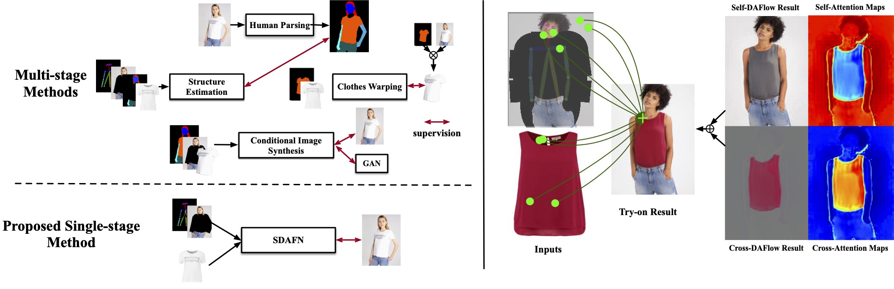
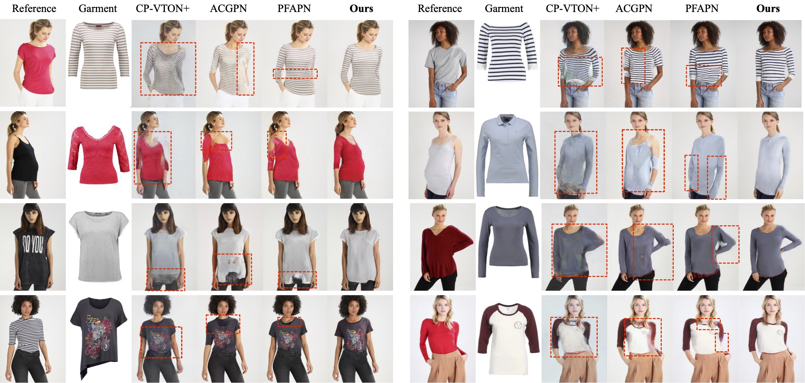
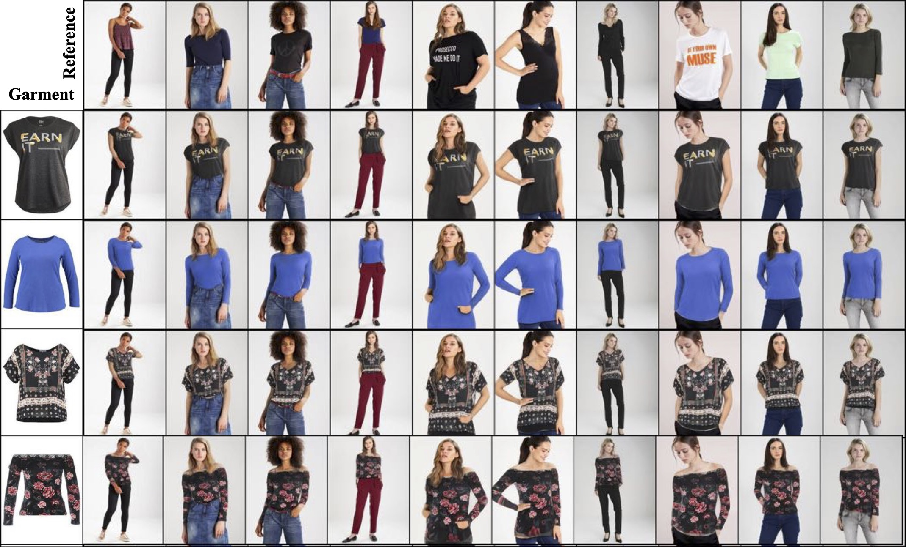
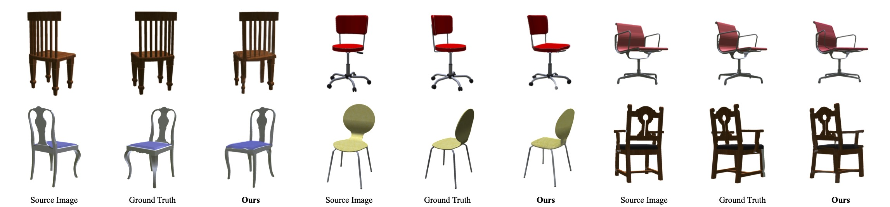

# Single Stage Virtual Try-on via Deformable Attention Flows

**Official code for ECCV2022 paper "[Single Stage Virtual Try-on via Deformable Attention Flows](https://arxiv.org/abs/2207.09161)"**

     
    
     

We propose a single-stage try-on framework by developing a novel Deformable Attention Flow (DAFlow), which applies the deformable attention scheme to multi-flow estimation. With pose keypoints as the guidance only, the self- and cross-deformable attention flows are estimated for the reference person and the garment images, respectively. By sampling multiple flow fields, the feature-level and pixel-level information from different semantic areas are simultaneously extracted and merged through the attention mechanism. It enables clothes warping and body synthesizing at the same time which leads to photo-realistic results in an end-to-end manner.

## Prepare

- Datasets: [Train_data](https://ofa-beijing.oss-cn-beijing.aliyuncs.com/datasets/VITON_train.tar) [Test_data](https://ofa-beijing.oss-cn-beijing.aliyuncs.com/datasets/VITON_test.tar), put the folders into `data/VITON`
- Checkpoints: [ckpt_viton.pt](https://ofa-beijing.oss-cn-beijing.aliyuncs.com/checkpoints/ckpt_viton.pt)
- python 3.6
- pytorch1.7
- torchvision 0.8

## Inference

Paired setting: In the paired setting, we have ground truth images.

`python -u test_SDAFNet_viton.py -b 8 --name TEST_PAIR --mode test --dataset_list VITON/test_pairs.txt`

Unpaired setting: In the unpaired setting, we do not have ground truth images. The `test_unpairs.txt` is same with [CPVTON-plus](https://github.com/minar09/cp-vton-plus/blob/master/data/test_pairs.txt) and [PFAFN](https://github.com/geyuying/PF-AFN)

`python -u test_SDAFNet_viton.py -b 8 --name TEST_UNPAIR --mode test --dataset_list VITON/test_unpairs.txt`

## Train
`python  train_SDAFNet_viton.py -b 8 --name VITON`

## Evaluation
- VITON dataset

Download the [checkpoint](https://www.mde),  which gets higher scores than reported in paper.

Paired setting. SSIM: 0.8539 using the pytorch SSIM repo. https://github.com/Po-Hsun-Su/pytorch-ssim

UnPaired setting. FID: 10.55 using the implementation to evaluate. https://github.com/toshas/torch-fidelity

## Results
- VITON dataset

     
    
     

- MPV dataset

     
    
     

- FashionVideo

     
    
     

- ShapeNet

     
    
     

## Acknowledgement
Our code references the implementation of [ClotFlow](https://openaccess.thecvf.com/content_ICCV_2019/papers/Han_ClothFlow_A_Flow-Based_Model_for_Clothed_Person_Generation_ICCV_2019_paper.pdf) and [PFAPN](https://github.com/geyuying/PF-AFN), including the feature extractors, feature pyramid networks (FPN) , and the design of the cascaded structure. Thanks for their awesome works.
## License
The use of this code is RESTRICTED to non-commercial research and educational purposes.
